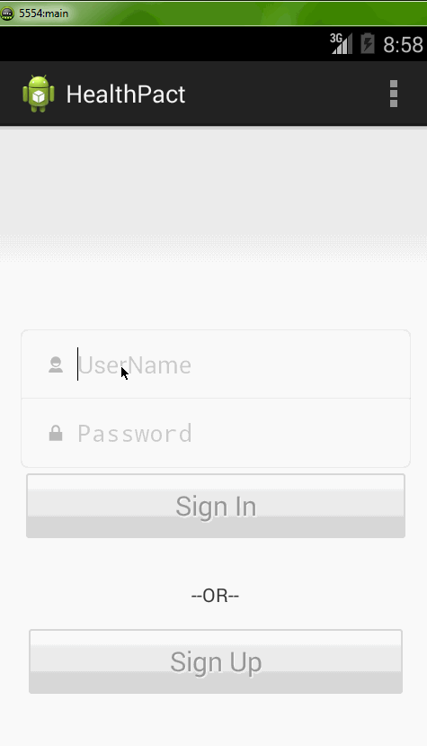

Usecases for group project on 3eesho. 
Group 3: Aravind Mudunuri, Dipankar Bhattacharyya, DVN Raju.
Mentor: Deepak Aggarawal

9. User/expert should create an account.
user/expert can sign on existing account
1. Ability to choose predefined plans.
a. User can find a plan based on predefined health condition.
c. Expert can create a custom plan/pick an existing plan and assign to user.
d. User can see how many people are following a plan.
e. User can also create custom plan.
4. User to update action of plan.
a. User can update status of action in plan.
5. Track progress of plan for assessment. visualize progress.
a. User can track progress for self assessment.
b. Show progress of plan based on status of actions in visualization.

7.  Ability to share plan.
a. User can share customplan.
b. Expert can also share their plans.

